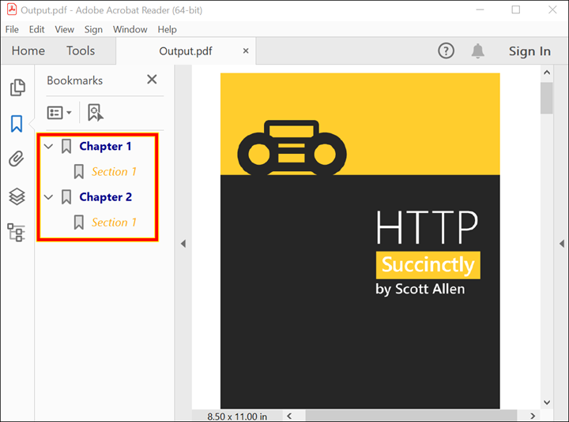

# Create, update and remove bookmarks in PDF document 

The Syncfusion .NET PDF library offers extensive support for creating, updating, and removing bookmarks in a PDF document. 

In this repository, we will explore various use cases of PDF bookmarks and how they can be implemented using the Syncfusion .NET PDF library. Some of the use cases that we will cover in this article include: 

* Add bookmarks in PDF document 
* Customize the bookmark style 
* Insert bookmarks in an existing PDF document
* Update/modify bookmarks
* Remove bookmarks from an existing PDF document 
* Get bookmarks and their page indexes from an existing PDF  

Sample name | Description
--- | ---
[Add bookmarks in PDF document](https://github.com/SyncfusionExamples/Create-update-and-remove-bookmarks-in-PDF-document/tree/master/Add_bookmarks_in_PDF_NET) | Add bookmarks in an existing PDF document. 
[Customize PDF bookmarks styles](https://github.com/SyncfusionExamples/Create-update-and-remove-bookmarks-in-PDF-document/tree/master/Customize_PDF_document_bookmarks_NET) | Customize the bookmarks in PDF document. 
[Insert bookmarks in PDF document](https://github.com/SyncfusionExamples/Create-update-and-remove-bookmarks-in-PDF-document/tree/master/Insert_bookmarks_in_existing_PDF_NET) | Insert bookmarks in an existing PDF document. 
[Update bookmarks in PDF document](https://github.com/SyncfusionExamples/Create-update-and-remove-bookmarks-in-PDF-document/tree/master/Update_bookmarks_in_PDF_NET) | Update or modify bookmarks in an existing PDF document. 
[Remove bookmarks from PDF document](https://github.com/SyncfusionExamples/Create-update-and-remove-bookmarks-in-PDF-document/tree/master/Remove_bookmarks_from_existing_PDF) | Remove bookmarks from an existing PDF document. 
[Get bookmarks index from PDF](https://github.com/SyncfusionExamples/Create-update-and-remove-bookmarks-in-PDF-document/tree/master/Get_bookmark_page_index_in_PDF) | Get bookmarks and their page indexes from an existing PDF document. 

## Add bookmarks in PDF document 
With the help of Syncfusion .NET PDF library, users can easily add parent and child bookmarks to both new and existing PDF documents. The following code example shows how to add bookmarks in an existing PDF document using C#.  

```csharp

//Load an existing PDF document
FileStream docStream = new FileStream("Input.pdf", FileMode.Open, FileAccess.Read);
PdfLoadedDocument document = new PdfLoadedDocument(docStream);

//Creates parent bookmark
PdfBookmark bookmark = document.Bookmarks.Add("Chapter 1");
//Sets the destination page
bookmark.Destination = new PdfDestination(document.Pages[1]);
//Sets the text style and color for parent bookmark 
bookmark.TextStyle = PdfTextStyle.Bold;
bookmark.Color = Color.Red;
//Sets the destination location for parent bookmark 
bookmark.Destination.Location = new PointF(20, 20);

//Adds the child bookmark
PdfBookmark childBookmark = bookmark.Insert(0, "Section 1");
//Sets the destination location for child bookmark 
childBookmark.Destination = new PdfDestination(document.Pages[1]);
childBookmark.Destination.Location = new PointF(0, 200);

``` 

By executing this code example, you will get a PDF document like the following screenshot. 


## Customize the bookmark style 

By leveraging this feature, users gain the ability to effortlessly create personalized bookmarks for their PDF documents. These customized bookmarks empower them with seamless navigation and streamlined access to specific sections or pages within the document. 

The following code example shows how to customize the PDF document bookmarks using C#. 

```csharp

//Load an existing PDF document 
FileStream docStream = new FileStream("Input.pdf", FileMode.Open, FileAccess.Read);
PdfLoadedDocument document = new PdfLoadedDocument(docStream);
 
//Creates parent bookmark 
PdfBookmark bookmark = document.Bookmarks.Add("Chapter 1");
//Sets the destination page 
bookmark.Destination = new PdfDestination(document.Pages[1]);
//Sets the text style and color for parent bookmark  
bookmark.TextStyle = PdfTextStyle.Bold;
bookmark.Color = Color.DarkBlue;
//Sets the destination location for parent bookmark  
bookmark.Destination.Location = new PointF(20, 20);
 
//Adds the child bookmark 
PdfBookmark childBookmark = bookmark.Insert(0, "Section 1");
//Sets the text style and color for child bookmark  
childBookmark.TextStyle = PdfTextStyle.Italic;
childBookmark.Color = Color.Orange;
//Sets the destination location for child bookmark  
childBookmark.Destination = new PdfDestination(document.Pages[1]);
childBookmark.Destination.Location = new PointF(0, 200);
 
//Creates parent bookmark 
PdfBookmark bookmark2 = document.Bookmarks.Add("Chapter 2");
//Sets the destination page 
bookmark2.Destination = new PdfDestination(document.Pages[1]);
//Sets the text style and color for parent bookmark  
bookmark2.TextStyle = PdfTextStyle.Bold;
bookmark2.Color = Color.DarkBlue;
//Sets the destination location for parent bookmark  
bookmark2.Destination.Location = new PointF(0, 500);
 
//Adds the child bookmark 
PdfBookmark childBookmark2 = bookmark2.Insert(0, "Section 1");
//Sets the text style and color for child bookmark  
childBookmark2.TextStyle = PdfTextStyle.Italic;
childBookmark2.Color = Color.Orange;
//Sets the destination location for child bookmark  
childBookmark2.Destination = new PdfDestination(document.Pages[1]);
childBookmark2.Destination.Location = new PointF(0, 500);

```

By executing this code example, you will get a PDF document like the following screenshot.


## Insert bookmarks in an existing PDF document
To insert bookmarks at any position in the bookmarks collection of an existing PDF document using the Syncfusion .NET PDF library, we need to load the existing PDF document first. The library loads all the bookmarks of the document, which enables us to insert bookmarks at any location based on the bookmark collection. 

The following code example shows how to insert bookmark in an existing PDF document using C#.

```csharp

//Load the PDF document.
FileStream docStream = new FileStream("Input.pdf", FileMode.Open, FileAccess.Read);
PdfLoadedDocument document = new PdfLoadedDocument(docStream);

//Inserts a new bookmark in the existing bookmark collection.
PdfBookmark bookmark = document.Bookmarks.Insert(0, "Title Page");
//Sets the destination page and location.
bookmark.Destination = new PdfDestination(document.Pages[0]);
bookmark.Destination.Location = new PointF(0, 0);
//Sets the text style and color.
bookmark.TextStyle = PdfTextStyle.Bold;
bookmark.Color = Color.Green;

```

By executing this code example, you will get a PDF document like the following screenshot. 


## Modify/update bookmarks 

Modifying or updating bookmarks in an existing PDF document is made possible with our library. The following modifications can be applied to bookmarks using our library:
* Modify the bookmark style, color, title, and destination. 
* Add or insert new bookmarks into the root collection. 
* Add or insert new bookmarks as a child of another bookmark. 
* Assign the destination of the added bookmarks to a loaded page or a new page of the document. 

```csharp

//Load the PDF document
FileStream docStream = new FileStream("Input.pdf", FileMode.Open, FileAccess.Read);
PdfLoadedDocument document = new PdfLoadedDocument(docStream);

//Gets all the bookmarks
PdfBookmarkBase bookmarks = document.Bookmarks;
//Gets the first bookmark and changes the properties of the bookmark
PdfLoadedBookmark bookmark = bookmarks[0] as PdfLoadedBookmark;
bookmark.Destination = new PdfDestination(document.Pages[2]);
bookmark.Color = Color.Green;
bookmark.TextStyle = PdfTextStyle.Bold;
bookmark.Title = "Chapter 2  ";

```

By executing this code example, you will get a PDF document like the following screenshot. 


## Remove bookmarks from an existing PDF document
If you're looking for a way to remove parent or child bookmarks from a PDF, Syncfusion provides a simple solution to achieve this.   

You can remove bookmarks from an existing PDF document using C# with the following code example. 

```csharp

//Load the PDF document.
FileStream docStream = new FileStream("Input.pdf", FileMode.Open, FileAccess.Read);
PdfLoadedDocument document = new PdfLoadedDocument(docStream);

//Gets all the bookmarks.
PdfBookmarkBase bookmarks = document.Bookmarks;

//Remove parent bookmark by index.
bookmarks.RemoveAt(1);

//Remove child bookmark by bookmark name. 
PdfLoadedBookmark parentBookmark = bookmarks[0] as PdfLoadedBookmark;
parentBookmark.Remove("Section 4");

```

By executing this code example, you will get a PDF document like the following screenshot. 


## Get bookmarks and their page indexes from an existing PDF document

The following code example shows how to get bookmarks and their page index from an existing PDF document using C#. 

```csharp

//Load the PDF document
FileStream docStream = new FileStream("Input.pdf", FileMode.Open, FileAccess.Read);
PdfLoadedDocument document = new PdfLoadedDocument(docStream);

//Gets all the bookmarks
PdfBookmarkBase bookmark = document.Bookmarks;
//Get the bookmark page index
int index = bookmark[0].Destination.PageIndex;

```

# How to run the examples
* Download this project to a location in your disk. 
* Open the solution file using Visual Studio. 
* Rebuild the solution to install the required NuGet package. 
* Run the application.

# Resources
*   **Product page:** [Syncfusion PDF Framework](https://www.syncfusion.com/document-processing/pdf-framework/net)
*   **Documentation page:** [Syncfusion .NET PDF library](https://help.syncfusion.com/file-formats/pdf/overview)
*   **Online demo:** [Syncfusion .NET PDF library - Online demos](https://ej2.syncfusion.com/aspnetcore/PDF/CompressExistingPDF#/bootstrap5)
*   **Blog:** [Syncfusion .NET PDF library - Blog](https://www.syncfusion.com/blogs/category/pdf)
*   **Knowledge Base:** [Syncfusion .NET PDF library - Knowledge Base](https://www.syncfusion.com/kb/windowsforms/pdf)
*   **EBooks:** [Syncfusion .NET PDF library - EBooks](https://www.syncfusion.com/succinctly-free-ebooks)
*   **FAQ:** [Syncfusion .NET PDF library - FAQ](https://www.syncfusion.com/faq/)

# Support and feedback
*   For any other queries, reach our [Syncfusion support team](https://www.syncfusion.com/support/directtrac/incidents/newincident?utm_source=github&utm_medium=listing&utm_campaign=github-docio-examples) or post the queries through the [community forums](https://www.syncfusion.com/forums?utm_source=github&utm_medium=listing&utm_campaign=github-docio-examples).
*   Request new feature through [Syncfusion feedback portal](https://www.syncfusion.com/feedback?utm_source=github&utm_medium=listing&utm_campaign=github-docio-examples).

# License
This is a commercial product and requires a paid license for possession or use. Syncfusion’s licensed software, including this component, is subject to the terms and conditions of [Syncfusion's EULA](https://www.syncfusion.com/eula/es/?utm_source=github&utm_medium=listing&utm_campaign=github-docio-examples). You can purchase a licnense [here](https://www.syncfusion.com/sales/products?utm_source=github&utm_medium=listing&utm_campaign=github-docio-examples) or start a free 30-day trial [here](https://www.syncfusion.com/account/manage-trials/start-trials?utm_source=github&utm_medium=listing&utm_campaign=github-docio-examples).

# About Syncfusion
Founded in 2001 and headquartered in Research Triangle Park, N.C., Syncfusion has more than 26,000+ customers and more than 1 million users, including large financial institutions, Fortune 500 companies, and global IT consultancies.

Today, we provide 1600+ components and frameworks for web ([Blazor](https://www.syncfusion.com/blazor-components?utm_source=github&utm_medium=listing&utm_campaign=github-docio-examples), [ASP.NET Core](https://www.syncfusion.com/aspnet-core-ui-controls?utm_source=github&utm_medium=listing&utm_campaign=github-docio-examples), [ASP.NET MVC](https://www.syncfusion.com/aspnet-mvc-ui-controls?utm_source=github&utm_medium=listing&utm_campaign=github-docio-examples), [ASP.NET WebForms](https://www.syncfusion.com/jquery/aspnet-webforms-ui-controls?utm_source=github&utm_medium=listing&utm_campaign=github-docio-examples), [JavaScript](https://www.syncfusion.com/javascript-ui-controls?utm_source=github&utm_medium=listing&utm_campaign=github-docio-examples), [Angular](https://www.syncfusion.com/angular-ui-components?utm_source=github&utm_medium=listing&utm_campaign=github-docio-examples), [React](https://www.syncfusion.com/react-ui-components?utm_source=github&utm_medium=listing&utm_campaign=github-docio-examples), [Vue](https://www.syncfusion.com/vue-ui-components?utm_source=github&utm_medium=listing&utm_campaign=github-docio-examples), and [Flutter](https://www.syncfusion.com/flutter-widgets?utm_source=github&utm_medium=listing&utm_campaign=github-docio-examples)), mobile ([Xamarin](https://www.syncfusion.com/xamarin-ui-controls?utm_source=github&utm_medium=listing&utm_campaign=github-docio-examples), [Flutter](https://www.syncfusion.com/flutter-widgets?utm_source=github&utm_medium=listing&utm_campaign=github-docio-examples), [UWP](https://www.syncfusion.com/uwp-ui-controls?utm_source=github&utm_medium=listing&utm_campaign=github-docio-examples), and [JavaScript](https://www.syncfusion.com/javascript-ui-controls?utm_source=github&utm_medium=listing&utm_campaign=github-docio-examples)), and desktop development ([WinForms](https://www.syncfusion.com/winforms-ui-controls?utm_source=github&utm_medium=listing&utm_campaign=github-docio-examples), [WPF](https://www.syncfusion.com/wpf-ui-controls?utm_source=github&utm_medium=listing&utm_campaign=github-docio-examples), [WinUI(Preview)](https://www.syncfusion.com/winui-controls?utm_source=github&utm_medium=listing&utm_campaign=github-docio-examples), [Flutter](https://www.syncfusion.com/flutter-widgets?utm_source=github&utm_medium=listing&utm_campaign=github-docio-examples) and [UWP](https://www.syncfusion.com/uwp-ui-controls?utm_source=github&utm_medium=listing&utm_campaign=github-docio-examples)). We provide ready-to-deploy enterprise software for dashboards, reports, data integration, and big data processing. Many customers have saved millions in licensing fees by deploying our software.